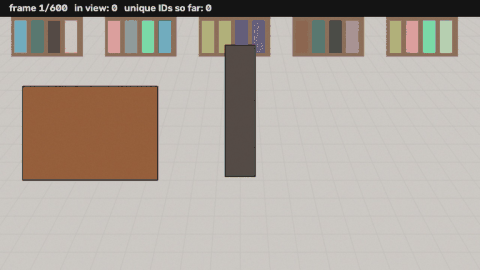

# Multi-Object Tracking Under Occlusion

Track and count people in crowded scenes (e.g. a retail store's ceiling cameras) with **consistent identities through occlusion**.
A COCO-pretrained YOLO11 detector feeds an online tracker that grows from **SORT** (Kalman filter + Hungarian) into an occlusion-aware tracker with a lost-track buffer, low-confidence (BYTE) association, camera-motion compensation and **appearance re-identification** of lost tracks. Evaluated on **MOT17** with MOTA / IDF1 / ID switches, with an automatic failure analysis that labels every ID switch as *occlusion*, *fast motion* or *similar-looking people*.



*Demo: MOT17-04, frames 1-300, full tracker (dashed boxes = positions filled in while the person was occluded).*

| Requirement from the brief | Where |
|---|---|
| Pretrained detector, no training | `mot_tracker/detector.py` (Ultralytics YOLO11, COCO weights, person class) |
| Tracker: Kalman + Hungarian | `mot_tracker/kalman.py`, `mot_tracker/matching.py`, `mot_tracker/tracker.py` |
| Re-associate after brief occlusion | LOST-track buffer + gated appearance re-ID (`tracker.py`, `appearance.py`), occlusion-recovery table in the report |
| Tracking metrics (MOTA, IDSW, IDF1) | `mot_tracker/evaluation.py`, `scripts/evaluate.py` |
| Failure-case analysis | `mot_tracker/analysis.py`, `scripts/analyze_failures.py` |
| Trajectory visualisation | `mot_tracker/visualize.py`, `scripts/visualize.py` |
| Write-up | `REPORT.md` (generated from the results by `scripts/make_report.py`) |

---

## 1. Setup

Python 3.9 – 3.13. A GPU is optional (CPU works, just slower).

```bash
git clone https://github.com/dragunxwho13/mot-occlusion-tracker.git
cd mot-occlusion-tracker
python -m venv .venv && source .venv/bin/activate     # Windows: .venv\Scripts\activate
pip install -r requirements.txt
python -m pytest -q tests                              # 8 fast unit tests, no data needed
```

YOLO weights (`yolo11m.pt`, 40 MB) are downloaded automatically by Ultralytics on first use.
For a CPU-only machine, `--weights yolo11n.pt --imgsz 960` is ~6x faster at some cost in recall.

## 2. Data

```bash
bash scripts/download_mot17.sh          # -> data/MOT17/{train,test}   (5.5 GB)
# or manually: https://motchallenge.net/data/MOT17.zip, unzip into data/
```

Expected layout (standard MOTChallenge):

```
data/MOT17/train/MOT17-02-FRCNN/{seqinfo.ini, img1/000001.jpg..., gt/gt.txt, det/det.txt}
```

MOT17 contains each video three times (`-DPM`, `-FRCNN`, `-SDP`) with identical frames and GT; the scripts use the `-FRCNN` copy so each video is counted once. MOT17 test ground truth is private, so evaluation runs on the 7 **train** sequences (nothing in this system is trained on them). MOT20 works the same way: `--data data/MOT20/train`.

**No dataset handy?** `python tools/make_synthetic_sequence.py` builds a 20-second scripted store-aisle clip (real people cut out of Ultralytics' sample photos, walking behind a pillar and a shelf, crossing, look-alike twins, a runner) in MOT format, so the whole pipeline can be smoke-tested in minutes.

## 3. Reproduce everything (one command)

```bash
python scripts/run_all.py --data data/MOT17/train                 # full benchmark
python scripts/run_all.py --data data/MOT17/train --quick         # MOT17-02/04/09, first 300 frames (CPU-friendly)
python scripts/run_all.py --data data/MOT17/train --public        # + tracker on official FRCNN detections
```

This runs, in order:

1. **Detection** once per sequence, cached in `results/cache_dets/` (every tracker variant reuses it).
2. **Ablation** – six tracker variants on identical detections: SORT → + lost buffer → + low-score association → + camera-motion compensation → + appearance re-ID (**full**) → + offline gap interpolation.
3. **Evaluation** – MOTA, IDF1, IDSW, Frag, FP, FN, MT/ML per sequence and overall.
4. **Failure analysis** – every ID switch classified; occlusion-recovery rate by gap length.
5. **Visualisation** – tracked video with trajectory tails + trajectory plot for a sample clip.
6. **REPORT.md** – the write-up, with every number filled in from the run.

Outputs:

```
results/
  REPORT.md                     write-up (copy to repo root for submission)
  ablation.md / .csv            overall metrics per tracker variant
  per_sequence.md               full tracker per sequence
  occlusion_recovery.png        % same ID kept after a gap, SORT vs full
  full/data/<seq>.txt           MOTChallenge-format results (online)
  full/data_interp/<seq>.txt    + gap interpolation
  full/analysis/                id_switch_cases.csv, id_switch_causes.png, switches_<seq>.png
  viz/<seq>_tracks.mp4 / .gif   tracked sample clip; viz/<seq>_trajectories.png
  viz_sort/<seq>_tracks.mp4     SORT on the same clip, for comparison
```

**Runtime.** Detection dominates: ~0.05 s/frame on a T4 GPU, ~1.3 s/frame for `yolo11m` @ 1280 on a 2-core CPU (all 5,316 MOT17 train frames ≈ 4 min GPU / ~2 h weak CPU). Tracking runs at ~100 FPS on CPU, so once detections are cached every ablation re-run takes seconds. `notebooks/reproduce_colab.ipynb` runs everything on a free Colab GPU.

**Smoke test without MOT17** (≈15 min on CPU, verified end-to-end):

```bash
python tools/make_synthetic_sequence.py --out data/SYNTH/train/SYNTH-01
python scripts/run_all.py --data data/SYNTH/train --out results_synth --viz-end 600
```

Its output is committed in [`results_synth/`](results_synth/REPORT.md).

## 4. Running pieces individually

```bash
# track (any preset: sort | sort_buffer | byte | byte_cmc | full)
python scripts/track.py --data data/MOT17/train --preset full --out results/full
python scripts/track.py --data data/MOT17/train --seqs MOT17-04 --preset sort --out results/sort

# re-run evaluation only (no tracking) on any folder of MOTChallenge result files
python scripts/evaluate.py --gt data/MOT17/train --results results/full/data
python scripts/evaluate.py --gt data/MOT17/train --results results/full/data_interp

# failure analysis (+ recovery plot comparing to another run)
python scripts/analyze_failures.py --gt data/MOT17/train --exp results/full --compare results/sort

# visualise a clip
python scripts/visualize.py --seq data/MOT17/train/MOT17-04-FRCNN \
    --results results/full/data_interp/MOT17-04-FRCNN.txt --start 1 --end 300 --out results/viz

# regenerate the write-up from existing results
python scripts/make_report.py --results results
```

Useful flags: `--weights yolo11n.pt|yolo11m.pt|yolo11x.pt`, `--imgsz 960|1280`, `--device 0` (GPU), `--appearance hist|resnet`, `--max-age 60`, `--max-frames 300`.

Result files follow the MOTChallenge format (`frame,id,x,y,w,h,score,-1,-1,-1`), so they can also be scored with the official [TrackEval](https://github.com/JonathonLuiten/TrackEval) (adds HOTA).

## 5. How the tracker works

```
           frame t
             │
     YOLO11 (person, conf ≥ 0.1) ──► appearance embedding (HSV part histogram)
             │                              │
  camera motion (optical flow) ──► warp Kalman predictions of all tracks
             │
  Stage 1  high-score dets ↔ TRACKED + LOST tracks
           visible: mean(1−IoU, appearance) · lost: 0.8·appearance + 0.2·Mahalanobis (gated) ── Hungarian
  Stage 2  low-score dets  ↔ remaining TRACKED tracks, IoU                   ── Hungarian
  Stage 3  remaining high dets ↔ tentative tracks, IoU                       ── Hungarian
             │
  unmatched tracked → LOST (kept 30 frames, still predicted)    unmatched high det → new track
```

Occlusion handling, in one sentence each:

* **Partial occlusion** → the detector's score drops → stage 2 still uses the low-score box, so the track never breaks.
* **Full occlusion** → the track becomes LOST and is coasted by its Kalman filter for up to 30 frames.
* **Re-appearance** → if the LOST track's predicted box no longer overlaps, the appearance template (frozen while the person was occluded) re-identifies them anywhere inside the motion gate, and the old ID is restored.
* **Offline**, the frames in between are filled by linear interpolation (dashed boxes in the video).

Design choices and results are discussed in [REPORT.md](REPORT.md).

## 6. Repository layout

```
mot_tracker/
  detector.py      YOLO wrapper + MOT17 public-detection reader
  kalman.py        8-state constant-velocity Kalman filter + gating
  matching.py      IoU, cosine distance, Hungarian assignment
  appearance.py    HSV part-histogram and ResNet-18 embedders
  cmc.py           camera-motion compensation
  tracker.py       OcclusionAwareTracker + presets (sort ... full)
  pipeline.py      detection caching and per-sequence runs
  postprocess.py   gap interpolation
  evaluation.py    MOTChallenge-protocol metrics on py-motmetrics
  analysis.py      ID-switch cause classification, occlusion recovery
  visualize.py     video with trajectory tails, trajectory plot, switch gallery
scripts/           run_all, track, evaluate, analyze_failures, visualize, make_report, download_mot17.sh
tools/             make_synthetic_sequence.py (smoke-test data)
tests/             unit tests
```

## References

Bewley et al., *Simple Online and Realtime Tracking* (SORT), 2016 · Wojke et al., *DeepSORT*, 2017 · Zhang et al., *ByteTrack*, 2022 · Aharon et al., *BoT-SORT* (camera-motion compensation), 2022 · Milan et al., *MOT16: A Benchmark for Multi-Object Tracking*, 2016 · Bernardin & Stiefelhagen, *CLEAR MOT metrics*, 2008 · Ristani et al., *IDF1*, 2016.
