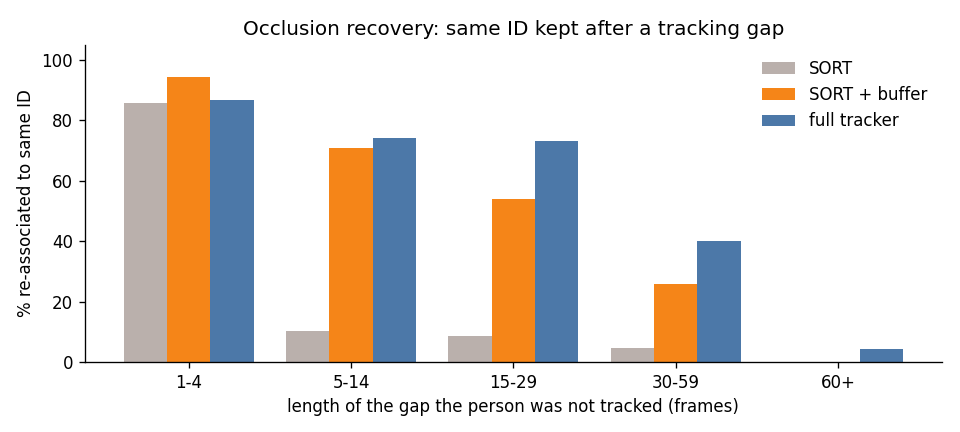
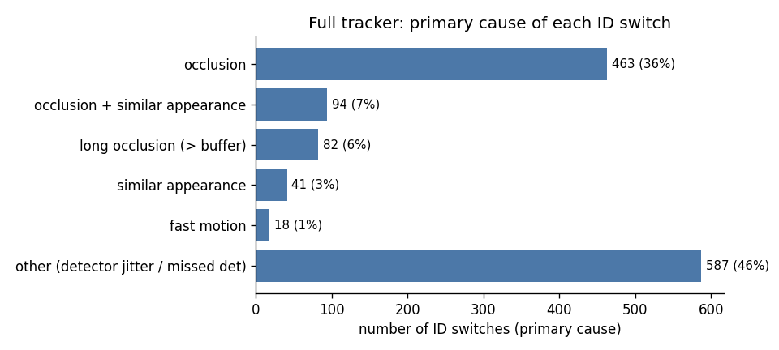
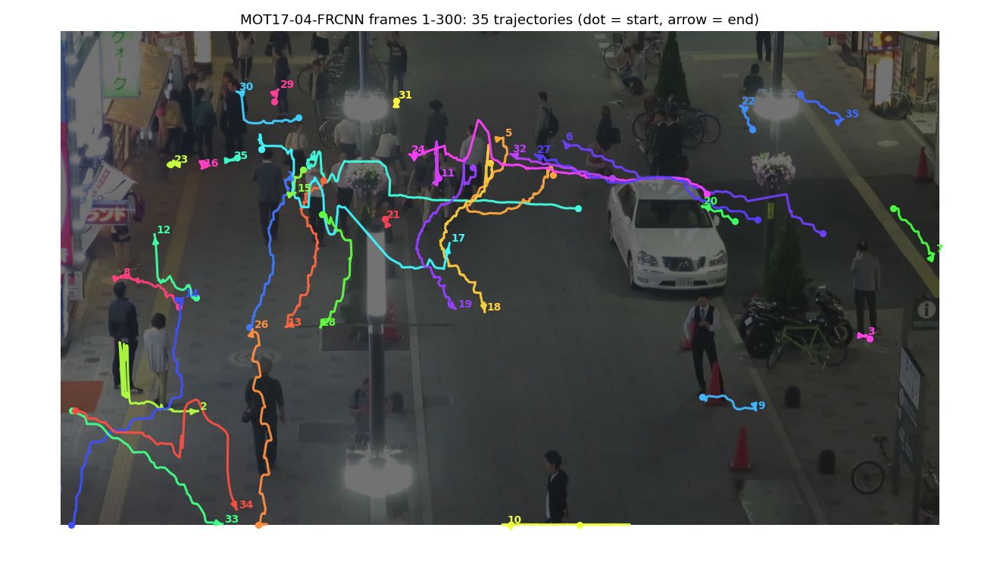

# Multi-Object Tracking Under Occlusion — write-up

Data: **MOT17** `data/MOT17/train`, sequences: MOT17-02-FRCNN, MOT17-04-FRCNN, MOT17-05-FRCNN, MOT17-09-FRCNN, MOT17-10-FRCNN, MOT17-11-FRCNN, MOT17-13-FRCNN. Detector: `yolo11m.pt` @ 1280 px. Appearance: `hist`.

## 1. Approach

**Pipeline.** `frame -> YOLO11 (COCO-pretrained, person class, conf >= 0.1) -> appearance embedding -> camera-motion estimate -> tracker -> MOT result file`.
No detector is trained; detections are computed once and cached, so every tracker variant below sees *identical* boxes and metric differences are due to the tracker alone.

**Tracker** (`mot_tracker/tracker.py`), built up from SORT:

| Component | What it does | Why |
|---|---|---|
| Kalman filter, state `(cx, cy, a, h, v...)` | constant-velocity motion model; noise scaled by box height | predicts where a person is while unseen |
| Hungarian assignment | optimal one-to-one det/track matching per frame (SciPy) | the SORT core |
| Lost-track buffer (30 frames @ 30 fps) | an unmatched track is kept as LOST and keeps being predicted instead of being deleted | lets a briefly occluded person get the *same* ID back |
| Two-stage association (BYTE) | high-score dets matched first; low-score dets (0.1-0.5) then matched to the remaining tracks by IoU | a half-occluded person gets a low detector score -- using it keeps the track alive through the occlusion |
| Appearance re-ID | part-based HSV colour histogram (head/torso/legs), EMA-smoothed per track. Visible tracks: cost = mean(IoU dist, appearance dist) for nearby boxes. LOST tracks: cost = 0.8 x appearance + 0.2 x normalised Mahalanobis, inside the gate | when a LOST track has drifted off the person, IoU is 0 -- appearance lets it be re-associated to its old ID; the motion term breaks ties between look-alikes |
| Mahalanobis gate (chi^2 95%, inflated x4 for LOST tracks) | appearance matches are only allowed where the motion model says the person could be | stops two similar-looking people on opposite sides of the frame from swapping |
| Camera-motion compensation | global similarity transform from sparse optical flow on background corners, applied to track states | MOT17-05/10/11/13 are filmed from a moving camera |
| Gap interpolation (offline only) | linear boxes for gaps <= 20 frames inside a track | recovers the frames during an occlusion once the ID is re-acquired |

**Evaluation.** MOTChallenge protocol re-implemented on `py-motmetrics`: IoU >= 0.5, only class-1 pedestrians with the consider flag count, tracker boxes on distractor classes (static person, reflection, person on vehicle) are ignored. MOT17 test GT is private, so all numbers are on the **MOT17 train** split; because the detector is COCO-pretrained and the tracker has no learned parameters, train is not a seen split for any part of the system.

## 2. Key decisions

1. **Pretrained YOLO11 instead of the MOT17 public detections.** Modern COCO detectors are far stronger than DPM/FRCNN public boxes; detection quality bounds MOTA. `--public` reruns the full tracker on the official FRCNN detections for a tracker-only comparison.
2. **Keep low-confidence detections.** The detector runs at conf 0.1; the tracker decides what to do with weak boxes (only extend existing tracks, never start new ones). This is the single most effective occlusion trick.
3. **Appearance only where motion agrees, and never alone.** Pure appearance matching swaps IDs between people in similar clothing, and taking `min(IoU cost, appearance cost)` (BoT-SORT style) makes two look-alikes equally cheap so the Hungarian tie-break is arbitrary -- this produced a twin swap in testing. So appearance is *averaged* with IoU for visible tracks, mixed with a Mahalanobis term for lost tracks, and only allowed for pairs already plausible by motion (IoU distance < 0.5, or inside the inflated Kalman gate).
4. **Don't learn appearance from occluded crops.** A track's appearance template is not updated when its detection overlaps another detection (IoU > 0.3), otherwise the template absorbs the occluder's colours and re-ID then fails.
5. **Colour-histogram embedding instead of a deep re-ID net.** No extra weights or GPU, and for re-acquiring someone after 1-2 s clothing colour is the dominant cue. A ResNet-18 backend is included (`--appearance resnet`) as an alternative.
6. **Ablation on shared detections** so each row adds exactly one idea.

## 3. Results

### 3.1 Ablation (all sequences combined)

| Tracker variant (same detections)        |   MOTA |   IDF1 |   IDSW |   Frag |    FP |    FN |   MT |   ML |
|:-----------------------------------------|-------:|-------:|-------:|-------:|------:|------:|-----:|-----:|
| SORT (IoU + Hungarian, no memory)        |   40.1 |   44.4 |    812 |   1526 |  4571 | 61864 |   97 |  207 |
| + 30-frame lost-track buffer             |   41.5 |   50.6 |    474 |   2015 |  4896 | 60296 |  100 |  198 |
| + low-score det. association (BYTE)      |   44.8 |   53.8 |    431 |    866 |  7060 | 54522 |  128 |  177 |
| + camera-motion compensation             |   45.4 |   56   |    252 |    807 |  7144 | 53900 |  138 |  175 |
| + appearance re-ID of lost tracks (full) |   44.4 |   56.5 |   1285 |   1022 |  7446 | 53664 |  135 |  177 |
| + gap interpolation (offline)            |   43.9 |   56.8 |    393 |    674 | 11155 | 51464 |  162 |  168 |
| full tracker, MOT17 public FRCNN dets    |   48.6 |   54.6 |   1631 |   1164 |  1854 | 54207 |  108 |  171 |

Going from plain SORT to the full online tracker changes MOTA 40.1 -> 44.4, IDF1 44.4 -> 56.5 and ID switches 812 -> 1285 (58% more). With offline gap interpolation: MOTA 43.9, IDF1 56.8. MOTA is dominated by FN (missed people), which is a detector property; IDF1 and IDSW are what the tracker controls, and they are the metrics to read for the occlusion problem.

### 3.2 Per sequence (full tracker + interpolation)

| Sequence       |   MOTA |   IDF1 |   IDSW |   Frag |    FP |    FN |   MT |   ML |   Rcll |   Prcn |   MOTP |
|:---------------|-------:|-------:|-------:|-------:|------:|------:|-----:|-----:|-------:|-------:|-------:|
| MOT17-02-FRCNN |   35.3 |   45.9 |     43 |     90 |  1035 | 10942 |   12 |   30 |   41.1 |   88.1 |   80.4 |
| MOT17-04-FRCNN |   47.8 |   63.1 |     13 |     84 |  1831 | 22969 |   19 |   30 |   51.7 |   93.1 |   84.9 |
| MOT17-05-FRCNN |   11.5 |   37.5 |    174 |    155 |  3539 |  2412 |   43 |   23 |   65.1 |   56   |   72.3 |
| MOT17-09-FRCNN |   65.7 |   67   |     50 |     58 |   648 |  1128 |   15 |    1 |   78.8 |   86.6 |   79.9 |
| MOT17-10-FRCNN |   54.3 |   61.8 |     50 |    160 |  1316 |  4505 |   21 |    9 |   64.9 |   86.4 |   76.4 |
| MOT17-11-FRCNN |   44.5 |   57.2 |     28 |     45 |  2155 |  3057 |   29 |   30 |   67.6 |   74.7 |   82.6 |
| MOT17-13-FRCNN |   38.9 |   51   |     35 |     82 |   631 |  6451 |   23 |   45 |   44.6 |   89.2 |   77.4 |
| OVERALL        |   43.9 |   56.8 |    393 |    674 | 11155 | 51464 |  162 |  168 |   54.2 |   84.5 |   81   |

### 3.3 Does the tracker survive occlusion?

Every time a ground-truth person stopped being tracked and was later tracked again, did they get their *old* ID back? Cells: gaps where the same ID was kept / all gaps of that length (`gap` = consecutive frames without a matched box).

| gap (frames)   | SORT          | SORT + buffer   | full tracker   |
|:---------------|:--------------|:----------------|:---------------|
| 1-4            | 693/810 (86%) | 1261/1336 (94%) | 474/546 (87%)  |
| 5-14           | 39/383 (10%)  | 261/368 (71%)   | 180/243 (74%)  |
| 15-29          | 13/153 (8%)   | 86/159 (54%)    | 89/122 (73%)   |
| 30-59          | 5/104 (5%)    | 24/93 (26%)     | 26/65 (40%)    |
| 60+            | 0/76 (0%)     | 0/59 (0%)       | 2/46 (4%)      |

## 4. Failure analysis: where do ID switches happen?

Each ID switch of the full tracker is matched back to the last frame the person was tracked correctly and tagged (see `mot_tracker/analysis.py`): **occlusion** if GT visibility dropped below 0.5, the person overlapped another person (IoU > 0.3) or there was a tracking gap; **long occlusion** if the gap exceeded the 30-frame buffer; **fast motion** if the centre moved > 0.08 box-heights/frame; **similar appearance** if the new ID previously belonged to a different person whose colour histogram is > 0.85 cosine-similar.

| primary cause                        |   full tracker |   SORT |
|:-------------------------------------|---------------:|-------:|
| occlusion                            |            463 |    602 |
| occlusion + similar appearance       |             94 |     20 |
| long occlusion (> buffer)            |             82 |    168 |
| similar appearance                   |             41 |      0 |
| fast motion                          |             18 |      8 |
| other (detector jitter / missed det) |            587 |     14 |
| total                                |           1285 |    812 |

Of 1285 switches, 639 (50%) involve occlusion, 106 (8%) fast motion and 142 (11%) an identity exchange between similar-looking people (flags overlap). 925 are *exchanges* between two people and 112 are a new ID spawned for the same person. The most common primary cause is **other (detector jitter / missed det)**; the median switch follows a 0-frame gap with minimum visibility 0.70.

Examples (left: last correct frame, right: the switch) — [switches_MOT17-02-FRCNN](full/analysis/switches_MOT17-02-FRCNN.png), [switches_MOT17-04-FRCNN](full/analysis/switches_MOT17-04-FRCNN.png), [switches_MOT17-05-FRCNN](full/analysis/switches_MOT17-05-FRCNN.png), [switches_MOT17-09-FRCNN](full/analysis/switches_MOT17-09-FRCNN.png), [switches_MOT17-10-FRCNN](full/analysis/switches_MOT17-10-FRCNN.png), [switches_MOT17-11-FRCNN](full/analysis/switches_MOT17-11-FRCNN.png), [switches_MOT17-13-FRCNN](full/analysis/switches_MOT17-13-FRCNN.png).

**Interpretation.** 82 switches follow occlusions longer than the 30-frame buffer: the track had already been deleted, so a new ID was unavoidable for an online tracker with this buffer (a longer buffer trades these for more false re-identifications). 557 happen while people overlap each other: when two people cross, both Kalman predictions sit on the same detections and the detector often returns one merged box. Fast motion is the primary cause of 18 switches -- at 30 fps a walking person moves well under a tenth of their height per frame, so the motion model rarely loses them; CMC handles the moving-camera case. Similar-looking people are involved in 142 switch(es) -- the residual failure a colour histogram cannot resolve. The natural next step is a learned re-ID embedding (e.g. OSNet trained on Market-1501) plugged into `appearance.py`, which would also allow a longer LOST buffer without more false re-identifications.

## 5. Visualisation

`viz/MOT17-04-FRCNN_tracks.mp4` — frames 1-300 of MOT17-04-FRCNN: boxes, IDs and trajectory tails; dashed boxes are positions filled in while the person was occluded. `viz_sort/MOT17-04-FRCNN_tracks.mp4` is the SORT baseline on the same clip for comparison.

_Pipeline runtime: 26.0 min (excluding detection if it was cached)._
