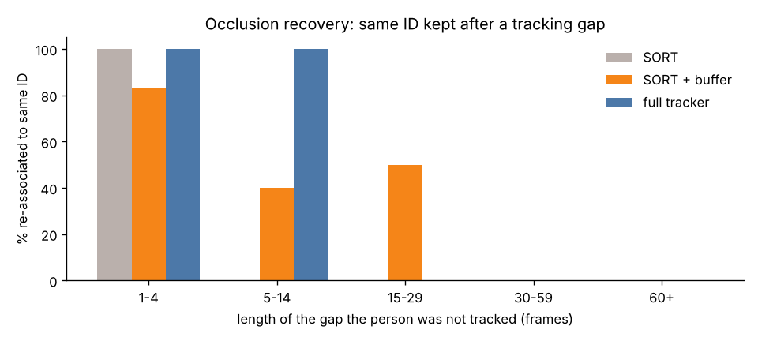
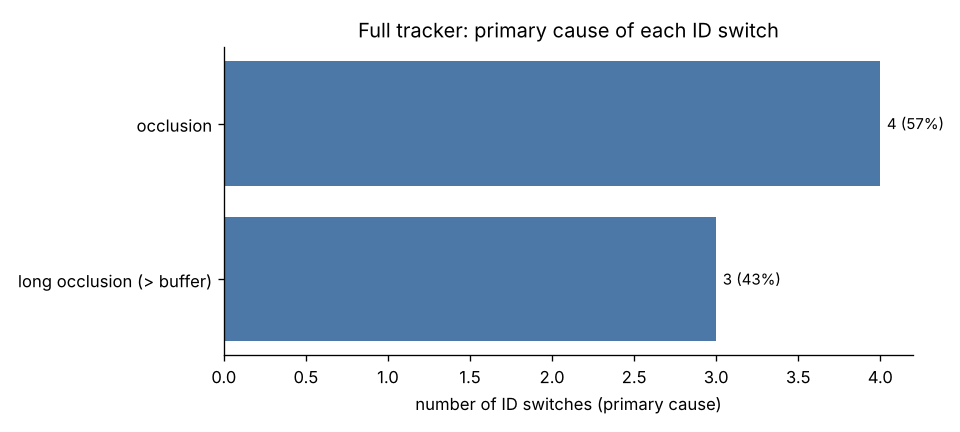
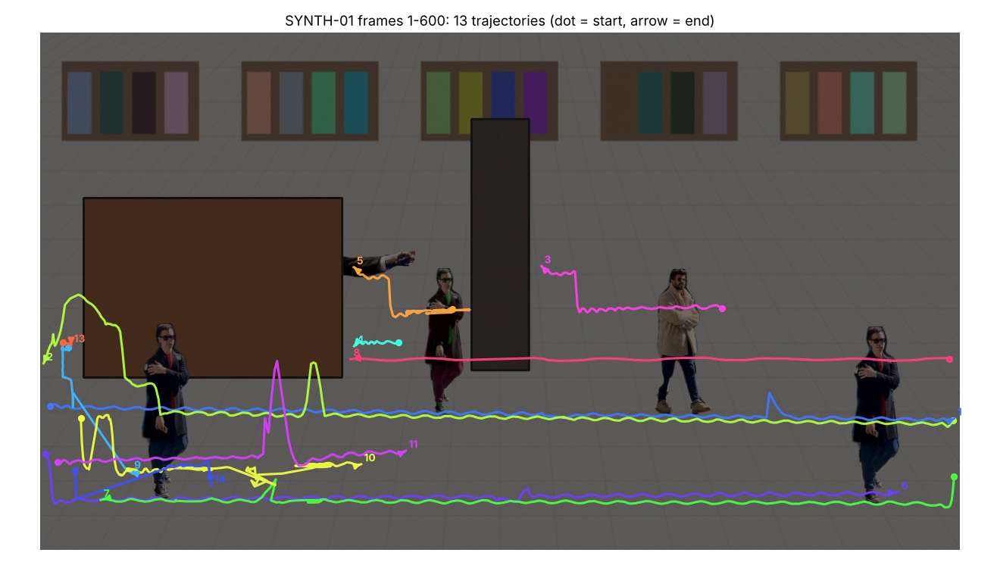

# Multi-Object Tracking Under Occlusion — write-up

Data: **SYNTH** `data/SYNTH/train`, sequences: SYNTH-01. Detector: `weights/yolo11m.pt` @ 1280 px. Appearance: `hist`.

> **Note:** these numbers come from the scripted synthetic smoke-test sequence (`tools/make_synthetic_sequence.py`), not from MOT17. Run `scripts/run_all.py --data data/MOT17/train` to regenerate this report on the benchmark.

## 1. Approach

**Pipeline.** `frame -> YOLO11 (COCO-pretrained, person class, conf >= 0.1) -> appearance embedding -> camera-motion estimate -> tracker -> MOT result file`.
No detector is trained; detections are computed once and cached, so every tracker variant below sees *identical* boxes and metric differences are due to the tracker alone.

**Tracker** (`mot_tracker/tracker.py`), built up from SORT:

| Component | What it does | Why |
|---|---|---|
| Kalman filter, state `(cx, cy, a, h, v...)` | constant-velocity motion model; noise scaled by box height | predicts where a person is while unseen |
| Hungarian assignment | optimal one-to-one det/track matching per frame (SciPy) | the SORT core |
| Lost-track buffer (30 frames @ 30 fps) | an unmatched track is kept as LOST and keeps being predicted instead of being deleted | lets a briefly occluded person get the *same* ID back |
| Two-stage association (BYTE) | high-score dets matched first; low-score dets (0.1-0.5) then matched to the remaining tracks by IoU | a half-occluded person gets a low detector score -- using it keeps the track alive through the occlusion |
| Appearance re-ID | part-based HSV colour histogram (head/torso/legs), EMA-smoothed per track. Visible tracks: cost = mean(IoU dist, appearance dist) for nearby boxes. LOST tracks: cost = 0.8 x appearance + 0.2 x normalised Mahalanobis, inside the gate | when a LOST track has drifted off the person, IoU is 0 -- appearance lets it be re-associated to its old ID; the motion term breaks ties between look-alikes |
| Mahalanobis gate (chi^2 95%, inflated x4 for LOST tracks) | appearance matches are only allowed where the motion model says the person could be | stops two similar-looking people on opposite sides of the frame from swapping |
| Camera-motion compensation | global similarity transform from sparse optical flow on background corners, applied to track states | MOT17-05/10/11/13 are filmed from a moving camera |
| Gap interpolation (offline only) | linear boxes for gaps <= 20 frames inside a track | recovers the frames during an occlusion once the ID is re-acquired |

**Evaluation.** MOTChallenge protocol re-implemented on `py-motmetrics`: IoU >= 0.5, only class-1 pedestrians with the consider flag count, tracker boxes on distractor classes (static person, reflection, person on vehicle) are ignored. MOT17 test GT is private, so all numbers are on the **MOT17 train** split; because the detector is COCO-pretrained and the tracker has no learned parameters, train is not a seen split for any part of the system.

## 2. Key decisions

1. **Pretrained YOLO11 instead of the MOT17 public detections.** Modern COCO detectors are far stronger than DPM/FRCNN public boxes; detection quality bounds MOTA. `--public` reruns the full tracker on the official FRCNN detections for a tracker-only comparison.
2. **Keep low-confidence detections.** The detector runs at conf 0.1; the tracker decides what to do with weak boxes (only extend existing tracks, never start new ones). This is the single most effective occlusion trick.
3. **Appearance only where motion agrees, and never alone.** Pure appearance matching swaps IDs between people in similar clothing, and taking `min(IoU cost, appearance cost)` (BoT-SORT style) makes two look-alikes equally cheap so the Hungarian tie-break is arbitrary -- this produced a twin swap in testing. So appearance is *averaged* with IoU for visible tracks, mixed with a Mahalanobis term for lost tracks, and only allowed for pairs already plausible by motion (IoU distance < 0.5, or inside the inflated Kalman gate).
4. **Don't learn appearance from occluded crops.** A track's appearance template is not updated when its detection overlaps another detection (IoU > 0.3), otherwise the template absorbs the occluder's colours and re-ID then fails.
5. **Colour-histogram embedding instead of a deep re-ID net.** No extra weights or GPU, and for re-acquiring someone after 1-2 s clothing colour is the dominant cue. A ResNet-18 backend is included (`--appearance resnet`) as an alternative.
6. **Ablation on shared detections** so each row adds exactly one idea.

## 3. Results

### 3.1 Ablation (all sequences combined)

| Tracker variant (same detections)        |   MOTA |   IDF1 |   IDSW |   Frag |   FP |   FN |   MT |   ML |
|:-----------------------------------------|-------:|-------:|-------:|-------:|-----:|-----:|-----:|-----:|
| SORT (IoU + Hungarian, no memory)        |   66.1 |   56.2 |     10 |     12 |  217 |  780 |    6 |    1 |
| + 30-frame lost-track buffer             |   64   |   56.8 |     10 |     15 |  258 |  801 |    5 |    1 |
| + low-score det. association (BYTE)      |   62.6 |   69.2 |      7 |     10 |  326 |  778 |    5 |    1 |
| + camera-motion compensation             |   62.6 |   69.2 |      7 |     10 |  326 |  778 |    5 |    1 |
| + appearance re-ID of lost tracks (full) |   63.9 |   75.4 |      7 |     14 |  318 |  749 |    5 |    1 |
| + gap interpolation (offline)            |   63.2 |   75.3 |      3 |      9 |  363 |  729 |    5 |    1 |

Going from plain SORT to the full online tracker changes MOTA 66.1 -> 63.9, IDF1 56.2 -> 75.4 and ID switches 10 -> 7 (30% fewer). With offline gap interpolation: MOTA 63.2, IDF1 75.3. MOTA is dominated by FN (missed people), which is a detector property; IDF1 and IDSW are what the tracker controls, and they are the metrics to read for the occlusion problem.

### 3.2 Per sequence (full tracker + interpolation)

| Sequence   |   MOTA |   IDF1 |   IDSW |   Frag |   FP |   FN |   MT |   ML |   Rcll |   Prcn |   MOTP |
|:-----------|-------:|-------:|-------:|-------:|-----:|-----:|-----:|-----:|-------:|-------:|-------:|
| SYNTH-01   |   63.2 |   75.3 |      3 |      9 |  363 |  729 |    5 |    1 |   75.5 |   86.1 |   89.3 |
| OVERALL    |   63.2 |   75.3 |      3 |      9 |  363 |  729 |    5 |    1 |   75.5 |   86.1 |   89.3 |

### 3.3 Does the tracker survive occlusion?

Every time a ground-truth person stopped being tracked and was later tracked again, did they get their *old* ID back? Cells: gaps where the same ID was kept / all gaps of that length (`gap` = consecutive frames without a matched box).

| gap (frames)   | SORT       | SORT + buffer   | full tracker   |
|:---------------|:-----------|:----------------|:---------------|
| 1-4            | 3/3 (100%) | 5/6 (83%)       | 8/8 (100%)     |
| 5-14           | 0/6 (0%)   | 2/5 (40%)       | 3/3 (100%)     |
| 15-29          | 0/1 (0%)   | 1/2 (50%)       | –              |
| 30-59          | –          | –               | 0/1 (0%)       |
| 60+            | 0/2 (0%)   | 0/2 (0%)        | 0/2 (0%)       |

## 4. Failure analysis: where do ID switches happen?

Each ID switch of the full tracker is matched back to the last frame the person was tracked correctly and tagged (see `mot_tracker/analysis.py`): **occlusion** if GT visibility dropped below 0.5, the person overlapped another person (IoU > 0.3) or there was a tracking gap; **long occlusion** if the gap exceeded the 30-frame buffer; **fast motion** if the centre moved > 0.08 box-heights/frame; **similar appearance** if the new ID previously belonged to a different person whose colour histogram is > 0.85 cosine-similar.

| primary cause                        |   full tracker |   SORT |
|:-------------------------------------|---------------:|-------:|
| occlusion                            |              4 |      7 |
| long occlusion (> buffer)            |              3 |      2 |
| other (detector jitter / missed det) |              0 |      1 |
| total                                |              7 |     10 |

Of 7 switches, 7 (100%) involve occlusion, 0 (0%) fast motion and 0 (0%) an identity exchange between similar-looking people (flags overlap). 2 are *exchanges* between two people and 3 are a new ID spawned for the same person. The most common primary cause is **occlusion**; the median switch follows a 0-frame gap with minimum visibility 0.41.

Examples (left: last correct frame, right: the switch) — [switches_SYNTH-01](full/analysis/switches_SYNTH-01.png).

**Interpretation.** Occlusion is the dominant failure mode (7/7 switches). 3 switches follow occlusions longer than the 30-frame buffer: the track had already been deleted, so a new ID was unavoidable for an online tracker with this buffer (a longer buffer trades these for more false re-identifications). 4 happen while people overlap each other: when two people cross, both Kalman predictions sit on the same detections and the detector often returns one merged box. Fast motion is the primary cause of 0 switches -- at 30 fps a walking person moves well under a tenth of their height per frame, so the motion model rarely loses them; CMC handles the moving-camera case. Similar-looking people are involved in 0 switch(es). The natural next step is a learned re-ID embedding (e.g. OSNet trained on Market-1501) plugged into `appearance.py`, which would also allow a longer LOST buffer without more false re-identifications.

## 5. Visualisation

`viz/SYNTH-01_tracks.mp4` — frames 1-600 of SYNTH-01: boxes, IDs and trajectory tails; dashed boxes are positions filled in while the person was occluded. `viz_sort/SYNTH-01_tracks.mp4` is the SORT baseline on the same clip for comparison.

_Pipeline runtime: 0.6 min (excluding detection if it was cached)._
